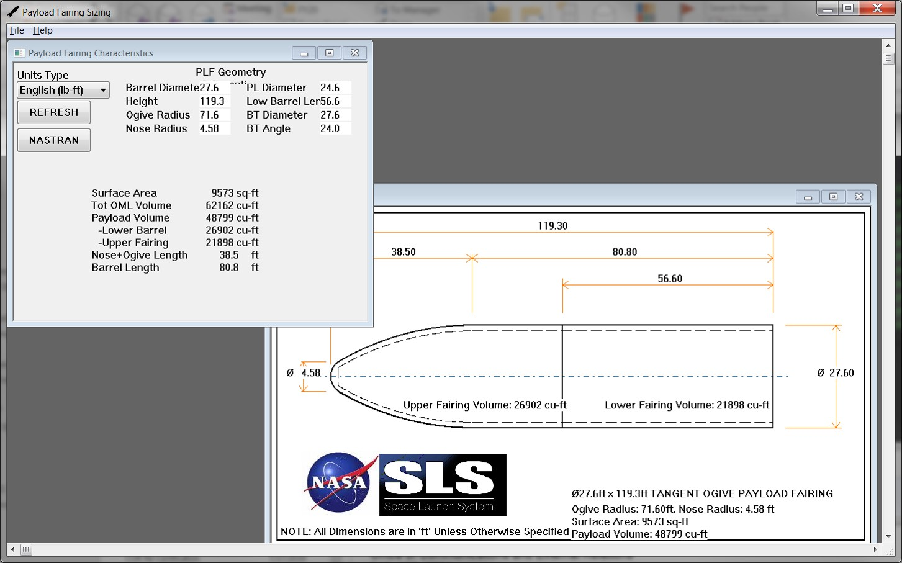

## Payload Fairing Sizer

This is a toy MS Windows program I wrote using the MinGW gcc compiler and MS Windows system libraries to model various payload fairing dimensions on a notebook paper sized drawing for reference.  The program also generates NASTRAN bulk data for structural analysis.

This program was written for educational purposes only!

** -> The program was never used by NASA in any official capacity. <- **

The effort was abandoned in 2012 and I am making it available for review/learning as an exercise in win32 system programming and for integrating c and lua.

## Getting Started

To download:

> git clone https://github.com/asuttles/PLFSizer.git

From the top-level directory, make the executable:

> make

## Prerequisites

The executable is compiled by the win32 version of the mingw gcc compiler and is not guaranteed to work with other compilers or version of gcc.

See the makefile for a list of needed libraries.

## How To Use

Enter PLF geometry in dialogue boxes and press refresh to update small drawing.
Press 'NASTRAN' button to generate a Bulk Data File (BDF) of the geometry for analysis.

## Author

* **Andrew Suttles** - [asuttles](github.com/asuttles)

## License

I did develop this small project as a learning exercise while working on a NASA payload fairing project.  The code was never used on the project in any capacity and has been abandonded.  I've placed a GPL license on it so that it cannot be used for commercial purposes.  Otherwise the code is open to be studied as an example of win32 system programming.

This project is licensed under the GPL License - see the [LICENSE](LICENSE.gpl) file for details.

